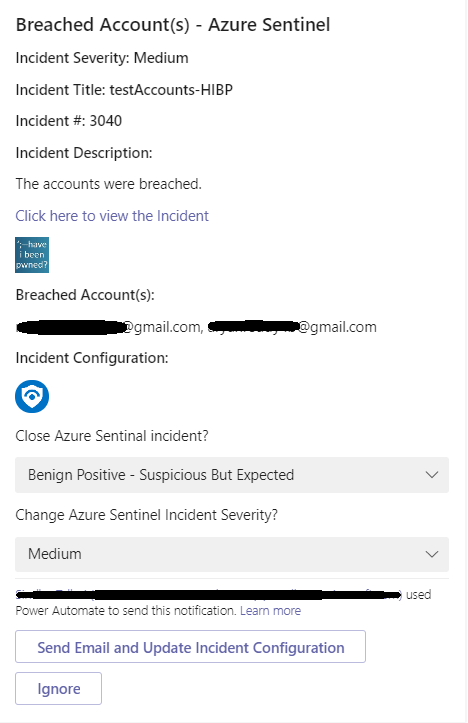
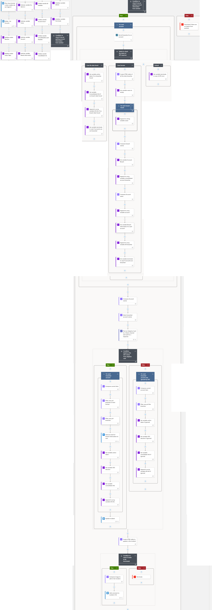

# HaveIBeenPwned ResponseonTeams playbook
 ## Summary
 When a new Azure Sentinel incident is created, this playbook gets triggered and performs below actions:
 1. Fetches the breach information from HaveIBeenPwned.
 1. Send an email to breached user account and change incident configuration based on SOC action.
 1. Add a comment to the incident with the information collected from the HaveIBeenPwned, action taken by SOC and close the incident.

**Adaptive card that will be sent in the Teams SOC Channel:**

**Playbook overview:**

**Email sent to pwned user:**

### Prerequisites 

1. HaveIBeenPwned Custom Connector needs to be deployed prior to the deployment of this playbook under the same subscription and under the same resource group.
2. Generate an API key. [Refer this link on how to generate the API Key](https://haveibeenpwned.com/API/Key).
3. Users must have access to Microsoft Teams and they should be a part of a Teams channel and also "Power Automate" app should be installed in the Microsoft Teams channel.

### Deployment instructions 
1. Deploy the playbook by clicking on "Deploy to Azure" button. This will lead you to the wizard for deploying an ARM Template.
2. Fill in the required parameters:
    * Playbook Name: Enter the playbook name here (Ex: HaveIBeenPwned_ResponseOnTeams)
    
### Post-Deployment instructions 
After deploying the playbook ,open the designer view of the playbook, in the "Post an Adaptive Card to a Teams channel and wait for a response" action, select the team and channel name from the dropdown to post the adaptive card.
####a. Authorize connections
Once deployment is complete, you will need to authorize each connection.
1.	Click the Azure Sentinel connection resource
2.	Click edit API connection
3.	Click Authorize
4.	Sign in
5.	Click Save
6.	Repeat steps for other connections such as Teams connection, Office 365 connection and HaveIBeenPwned API Connection (For authorizing the HaveIBeenPwned API connection, API Key needs to be provided)
####b. Configurations in Sentinel
1. In Azure sentinel analytical rules should be configured to trigger an incident with risky account.
2. Configure the automation rules to trigger this playbook.

 [](https://login.microsoftonline.us/organizations/oauth2/v2.0/authorize?client_id=c836cbdb-7a5b-44cc-a54f-564b4b486fc6&response_type=code%20id_token&scope=https%3A%2F%2Fmanagement.core.usgovcloudapi.net%2F%2Fuser_impersonation%20openid%20email%20profile&state=OpenIdConnect.AuthenticationProperties%3DaURMJdv8OOjkos8hJrPp2UR3SiCuzPqKSCojZXlvmudMu2wCQivYUBL-PUpm2VklFejdDnBr9Us32MzfuH8tith-XldC_OIlCqCjwB950H9ELHA76IfBBh19cTzh9-nsHhkQkk8wQDSE6bot7rUuEQB8IDVJgDMCfv1HYuUg9brFyPen2T4DF7f3SxN7Wwxfj87B5iDMqyoU1AHKentIKfwHsDQCVmhbtWdvSgPbWWABKGY-a7b1vkmjWNmo8x5v&response_mode=form_post&nonce=637443070124899368.YjM5MDcwYzMtODJkZC00MzRmLTgxNDctMjhhZjY0MWRmNjcxZGRiOWNmMmItMDAyNS00MTIxLWE4MDUtMjdiOTE4MWJhMjg0&redirect_uri=https%3A%2F%2Fportal.azure.us%2Fsignin%2Findex%2F&site_id=501430&msafed=0&client-request-id=5cc07576-a6f1-4a94-b26f-830ed1c4ad77&x-client-SKU=ID_NET45&x-client-ver=5.3.0.0)

## Playbook steps explained

###When Azure Sentinel incident creation rule is triggered
Azure Sentinel incident is created. The playbook receives the incident as the input.

###Entities - Get Accounts
Get the list of risky Accounts as entities from the Incident.

###Initialize the below variables

  a. BreachInfo - Append the account breach information.

  b. ActionTaken - Append the action taken by SOC.

  c. Breaches - Assign account breach Information for a particular account.

 ###Compose image to add in the incident
This action will compose the HaveIBeenPwned image to add to the incident comments.

###For each Account
* Get all the breaches for the account from HaveIBeenPwned API action.
* Based on the response from API,the following actions will be taken:
 * If breach information found, post an adaptive card and wait for the SOC action, if SOC has selected "Send email and Update Incident" then send email to user and update incident else Ignore
 * If no breach information found: Update incident with no breach information found

